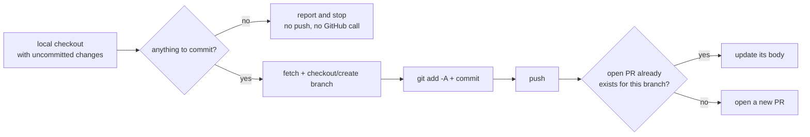

# Appliqation PR-Raise

**Commits whatever's already changed in a local checkout, pushes, and opens (or reuses) a pull request.**

Fully mechanical — no LLM anywhere in this repo. Deciding *what* to change is someone else's job (a human, or a sibling agent like [`appliqation-scriptgen`](https://github.com/appliqation/scriptgen) or [`appliqation-defect-fix`](https://github.com/appliqation/defect-fix)); this repo's only job is turning an already-made change into a real, reviewable pull request, reliably and idempotently.

## Why a separate, dumb agent

Committing a known set of files and opening a PR needs no judgment — so it doesn't get one. Every other agent in this family stops at "write the files locally"; none of them touch git or GitHub. This is the one place that does, which keeps the blast radius of any single agent's mistake contained: a bad fix from `appliqation-defect-fix` produces a bad PR you can review and close, never a bad push nobody saw coming from inside a reasoning loop.

## How it works



- **Credentials are its own.** It never reads Appliqation's per-project GitHub PAT — it authenticates with its own `GITHUB_TOKEN`, kept entirely separate from appq's credential store by design.
- **Idempotent PR handling.** Re-running against a branch that already has an open PR updates that PR's body instead of opening a second one.
- **No-op is a real, reported outcome.** If there's nothing to commit, it says so and stops — it never pushes or touches GitHub for a no-op.

## Quick start

```bash
npm install -g @appliqation/pr-raise
```

Create a `.env` file (in whatever directory you'll run it from) with:

```
APPQ_API_KEY=your-appliqation-api-key   # read-only, repo lookup only
GITHUB_TOKEN=your-github-token           # this agent's own, with repo write access
```

```bash
appliqation-pr-raise raise \
  --project-id <id> \
  --repo-path /path/to/your/checkout \
  --branch-name my-branch \
  --pr-title "My change"
```

`--project-id` resolves the target repo/branch via Appliqation's `get_project_settings` (location only — no credentials come from there). Add `--pr-body`/`--pr-body-file`, `--base-branch`, or `--commit-message` as needed; `--json` prints a structured result instead of the human summary.

## Configuration

Copy `.env.example` to `.env`. Requires `APPQ_API_KEY` (read-only) and `GITHUB_TOKEN` (this agent's own, with repo write access).

## Running this safely

Unlike the rest of this family, nothing here is LLM-directed — every git/GitHub call this agent makes is a fixed operation this code decides, never something a model chooses on the fly, so there's no prompt-injection-driven "wrong destination" risk the way there is for an agent driving a browser or a shell. The real exposure is simpler: `GITHUB_TOKEN` is a genuine credential with real push access, sent over the network on every run (via an HTTP header, never in argv — see `gitClient.ts`).

**Run this inside a container with an egress allowlist** anyway, consistent with the rest of the family and cheap insurance regardless: this process only ever legitimately needs to reach your configured `APPQ_ORIGIN` (`appq.appliqation.io` by default) and `github.com`/`api.github.com`. Anything else is unexpected and worth investigating.

## Development

```bash
git clone https://github.com/appliqation/pr-raise.git
cd pr-raise
npm install
cp .env.example .env   # fill in APPQ_API_KEY (read-only, repo lookup only) and GITHUB_TOKEN
npm run dev -- raise --project-id <id> --repo-path <path> --branch-name <name> --pr-title <title>
npm run typecheck
npm test
```

See `CLAUDE.md` for a map of this repo if you're working in it with an AI coding assistant.

## License

MIT — see [LICENSE](./LICENSE).
